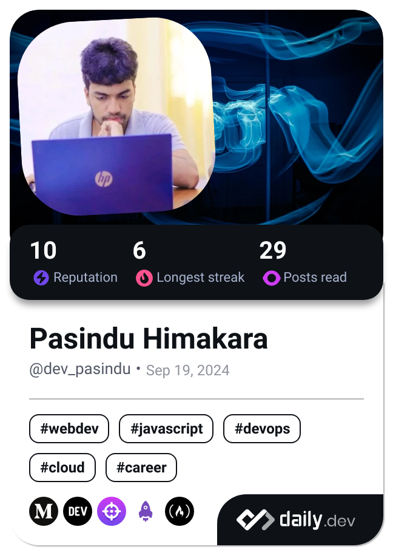

  

<h2 align="center">Backend Engineering | DevOps & Cloud</h2>

  

## :calling:Connect with me:
- Email:  ibhimakara@gmail.com
- LinkedIn:  <a href="https://linkedin.com/in/pasindu-himakara-b44885285">Vist My Profile</a>

## 🔭 I’m currently working on 
- Project following Micro Service architecture

## 🌱 I’m currently learning 
- DevOps
- Cloud Computing

## :computer:Technical Skills:
<h3 align=center>
  

</h3>

## :chart_with_downwards_trend:Github Stat:

  
  

 

  

  

 

  
  

## :bookmark_tabs:Learn and Collaborate:

  
  
  
  

